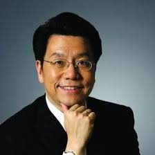

[slide]
# 《创业就是要细分垄断》读记
## 2019-01-16

[slide]
# 作者介绍 {:&.flexbox.vleft}
## 

 

<pre>
李开复
创新工场的董事长
</pre>
<pre>
汪华
创新工场的创始人
</pre>
<pre>
傅盛
猎豹移动（原金山网络）CEO</pre>

[slide]
# 目录 {:&.flexbox.vleft}
## 1. 为什么要细分垄断
## 2. 李开复谈互联网的幂定律
## 3. 汪华的创业经验
## 4. 傅盛的战略三部曲

[slide]
# 1. 为什么要细分垄断 {:&.flexbox.vleft}
## 为什么要细分垄断
* 创业公司只有有限的钱和资源，如果没有进展只能活一两年，所以只能创造小垄断
* 真正能让创业者有机会的在于，传统巨头没有看清趋势给了你先机，或者看清了也办法采纳和直接使用（极限验证）。

[slide]
# 2. 李开复谈互联网的幂定律 {:&.flexbox.vleft}
## 互联网产品符合幂定律
* 安卓和苹果系统占智能手机系统98%
* 电商领域，淘宝是其它所有电商之和
* 移动IM，微信一骑绝尘

 

## 人才符合幂定律
在工业社会，一个最好的，最有效率的个人能多生产20%～30%的产品。但是在信息社会中，一个好的人才，能够比一般人员多做出500%甚至1000%的工作。

[slide]
# 汪华的创业经验 {:&.flexbox.vleft}
## 几个观点
* 避免多边市场，要范式简单，避免变数和复杂性
* 跳板思维：我本来是想做B，但是为了把B做起来，我先做A，A做起来再给B倒流。1，创业每个环节有50%做成的可能性，多一个环节成功率呈数量级降低。2，创业者做的很多事情是有创业窗口的，先做A再做B，可能别人就直接把你的B做了。
* 乔布斯陷阱。创业者总觉得自己要做一个特别完美的产品，这样做的问题是公司没法扩张。追求完美需要更高的技术，更复杂的运营，导致自己的扩张成本和扩张速度跟不上别人。最后你只能被哪些做的比较糙但是扩张速度快很多的人干掉（代驾领域的安师傅和e代驾）。

[slide]
# 4. 傅盛的战略三部曲 {:&.flexbox.vleft}
## 猎豹移动的发展故事
xxxxx

[slide]
# 4. 傅盛的战略三部曲  {:&.flexbox.vleft}
## 战略三部曲：预测，破局，All in
xxxxx

[slide]
# Thanks
